# Shellscripting

01 - First Shell Script

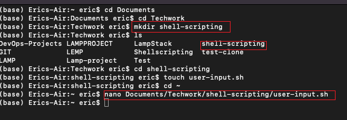

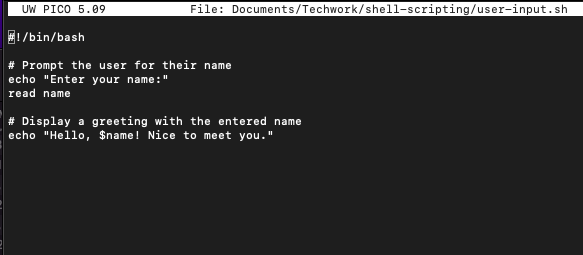

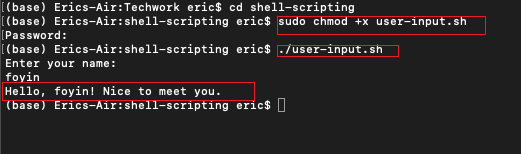

02 - Directory Manipulation and Navigation

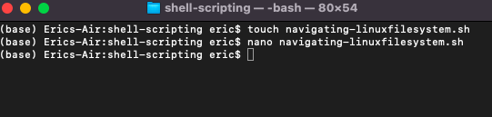

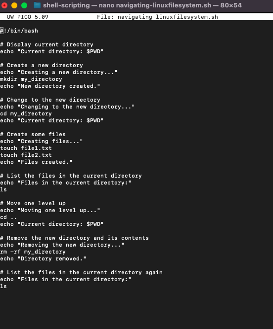

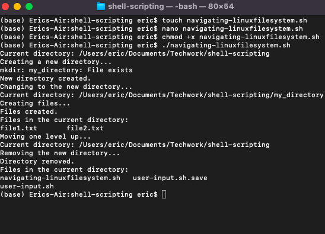

03 - File Operation and Sorting

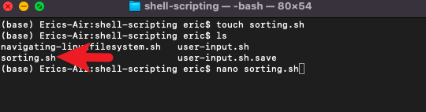

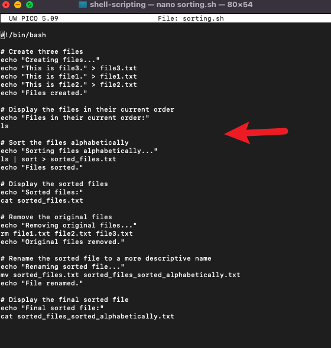

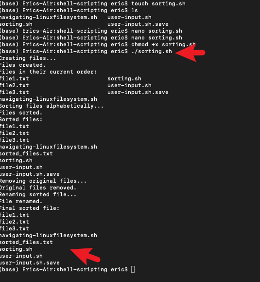

04 - Working with Numbers and Calculations

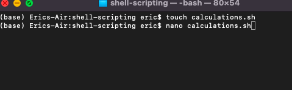

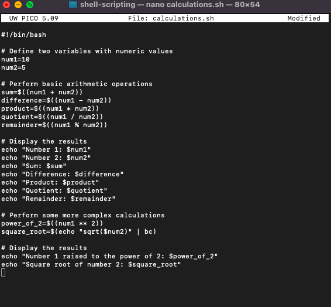

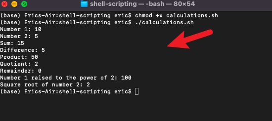

05 - File Backup and Timestamp

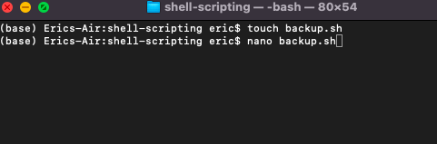

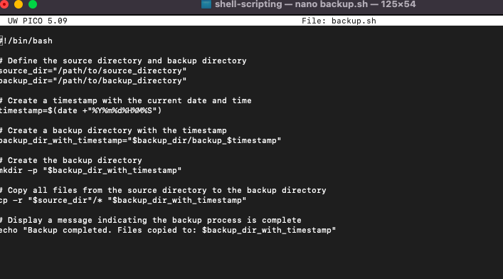

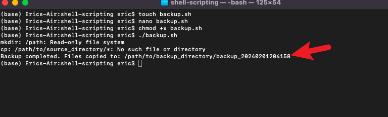

